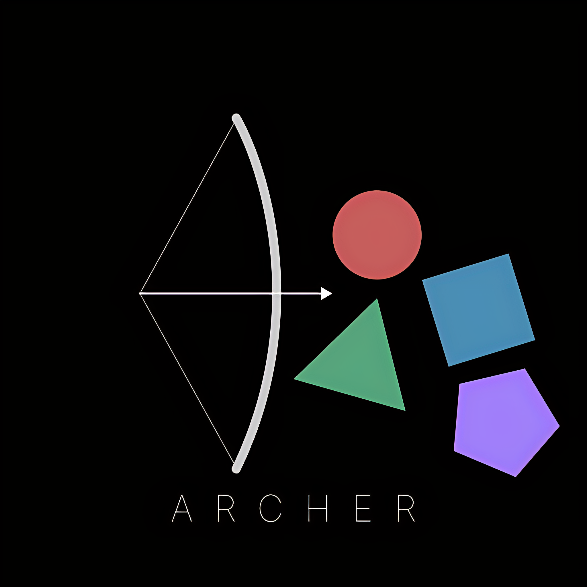
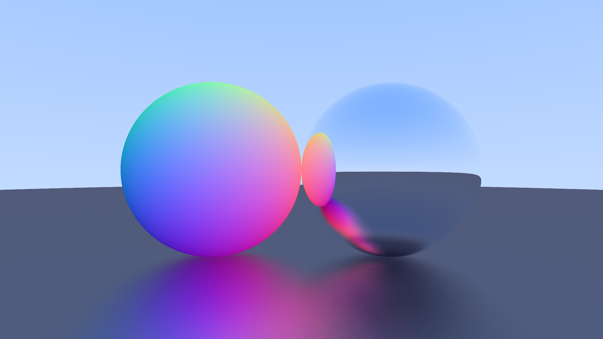

# Archer

A rusty ray tracing engine built to run with a decent frame rate even on CPU, allowing for realtime raytracing applications without GPUs.
All the code in this repo is heavily commented so that it is easy to follow. When complete, it will have a three.js-like usage format.

__Currently working on:__ A basic sphere scene

- [ ] Basic Sphere [Devlog 1]
- [ ] Skybox [Devlog 2a]
- [ ] Reflections [Devlog 2b]
- [ ] Refraction [Devlog 3]
- [ ] Optimization [Devlog 4a]
- [ ] BVH Implementation [Devlog 4b]
- [ ] Restir Implementation [Devlog 4c]

## Latest Render

## Thanks and Citations

[_Ray Tracing in One Weekend_](https://raytracing.github.io/books/RayTracingInOneWeekend.html) for showing how to do stuff
